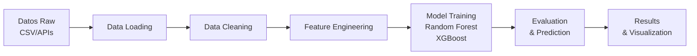

# 🏆 LM_LaLiga - Predicción del Ganador de La Liga Española

[](https://www.python.org/)
[](https://opensource.org/licenses/MIT)
[]()

Modelo de Machine Learning para predecir el ganador de la temporada actual de La Liga Española de fútbol basado en datos históricos, estadísticas en tiempo real y análisis de rendimiento de equipos.

## 📋 Descripción

Este proyecto utiliza técnicas avanzadas de Machine Learning para:
- **Predecir** el ganador de La Liga con análisis de tendencias
- **Analizar** estadísticas y rendimiento de equipos
- **Proyectar** clasificaciones finales basadas en desempeño actual
- **Procesar** datos desde múltiples fuentes (CSVs, APIs)
- **Entrenar** modelos con algoritmos como Random Forest, Gradient Boosting y XGBoost

## 🚀 Características Principales

✅ Predicción del campeón de La Liga
✅ Análisis en tiempo real de clasificaciones
✅ Múltiples algoritmos de ML (Random Forest, Gradient Boosting, XGBoost)
✅ Feature engineering automático
✅ Scraping de datos desde fuentes confiables
✅ API integración para datos actualizados
✅ Proyección de puntos finales

## 🛠️ Tecnologías

- **Lenguaje:** Python 3.8+
- **ML:** scikit-learn, XGBoost
- **Datos:** pandas, numpy
- **Scraping:** BeautifulSoup4, requests
- **Visualización:** matplotlib, seaborn
- **Otros:** jupyter, lxml

Ver [requirements.txt](requirements.txt) para la lista completa.

## 📦 Instalación

### Requisitos Previos
- Python 3.8 o superior
- pip o conda

### Pasos

1. **Clona el repositorio:**
```bash
git clone https://github.com/juakincruzz/LM_LaLiga.git
cd LM_LaLiga
```

2. **Crea un entorno virtual (recomendado):**
```bash
python -m venv venv
source venv/bin/activate  # En Windows: venv\Scripts\activate
```

3. **Instala las dependencias:**
```bash
pip install -r requirements.txt
```

4. **Configura variables de entorno (opcional):**
```bash
cp .env.example .env
# Edita .env y añade tu RAPIDAPI_KEY si deseas obtener datos en tiempo real
```

## 💻 Uso

### Opción 1: Pipeline Completo
Entrena el modelo con todos los datos:
```bash
python run_pipeline.py
```

### Opción 2: Predicción con Datos Actuales
Obtiene datos en tiempo real y predice el ganador:
```bash
python predict_champion_latest.py
```

### Opción 3: Actualizar Datos + Predecir
Actualiza datos y genera predicción completa:
```bash
python update_and_predict.py
```

### Scripts Individuales

**Cargar y procesar datos:**
```bash
python scripts/load_data.py
```

**Preprocesar y crear features:**
```bash
python scripts/preprocess.py
```

**Obtener datos actualizados:**
```bash
python scripts/fetch_updated_data.py
```

**Scraping de clasificación:**
```bash
python scripts/scraper_laliga.py
```

## 📊 Estructura del Proyecto

```
LM_LaLiga/
├── 📄 README.md                      # Este archivo
├── 📄 requirements.txt               # Dependencias Python
├── 📄 .gitignore                     # Archivos a ignorar en Git
├── 📄 .env.example                   # Variables de entorno (ejemplo)
├── 📄 CONTRIBUTING.md                # Guía de contribución
│
├── 🐍 run_pipeline.py                # Pipeline completo
├── 🐍 predict_champion_latest.py     # Predicción con datos en tiempo real
├── 🐍 update_and_predict.py          # Actualizar + Predecir
│
├── 📁 scripts/
│   ├── 🐍 load_data.py               # Carga y combinación de datos
│   ├── 🐍 preprocess.py              # Feature engineering
│   ├── 🐍 fetch_updated_data.py      # Obtención de datos de APIs
│   └── 🐍 scraper_laliga.py          # Scraping de clasificaciones
│
├── 📁 models/
│   └── 🐍 predictor.py               # Clase principal del modelo ML
│
├── 📁 notebooks/
│   └── 📓 exploratory_analysis.ipynb # Análisis exploratorio
│
└── 📁 data/
    ├── 📁 raw/
    │   ├── SP1.csv                   # Datos La Liga (football-data.org)
    │   └── football_matches.csv      # Datos adicionales de partidos
    └── 📁 processed/
        └── laliga_processed.csv      # Datos procesados
```

## 🔄 Flujo de Trabajo



## 📈 Modelos Disponibles

1. **Random Forest**: Ensemble de árboles de decisión
   - Excelente para capturar patrones complejos
   - Proporciona importancia de features

2. **Gradient Boosting**: Boosting secuencial
   - Mejor generalización
   - Iterativo e incremental

3. **XGBoost**: Gradient Boosting optimizado
   - Rendimiento superior
   - Manejo de datos faltantes
   - Regularización integrada

## 📊 Datos

El proyecto utiliza datos de múltiples fuentes:

### Fuentes de Datos
- **football-data.org**: Datos históricos de La Liga (CSV)
- **RapidAPI**: Datos en tiempo real de fixtures y estadísticas
- **Web Scraping**: Clasificaciones actualizadas

### Columnas Principales
```
- Date: Fecha del partido
- HomeTeam/AwayTeam: Equipos
- Home_Goals/Away_Goals: Goles anotados
- Home_Shots/Away_Shots: Tiros realizados
- Home_ShotsOnTarget/Away_ShotsOnTarget: Tiros a portería
- Home_Fouls/Away_Fouls: Faltas cometidas
- Home_Corners/Away_Corners: Córneres
- Home_Yellows/Away_Yellows: Tarjetas amarillas
- Result: Resultado (H/D/A)
```

## 🎯 Características (Features)

El modelo utiliza +30 características incluyendo:
- Estadísticas por equipo (victorias, goles promedio, defensa)
- Características de partidos (diferencias, ratios de efectividad)
- Datos históricos y tendencias
- xG (goles esperados simplificados)

## 📊 Ejemplos de Salida

```
════════════════════════════════════════════════════════════════════════════════════════
🏆 PREDICTOR DE LA LIGA 2025-2026 - DATOS EN TIEMPO REAL
════════════════════════════════════════════════════════════════════════════════════════

[1/3] OBTENIENDO DATOS EN TIEMPO REAL...
✓ Datos obtenidos: 60 equipos

[2/3] MOSTRANDO CLASIFICACIÓN ACTUAL...
POS   EQUIPO                PJ    V     E     D     GF    GC    DG    PTS
────────────────────────────────────────────────────────────────────────────
1     Real Madrid           16    12    2     2     38    12    26    38
2     Barcelona             16    11    3     2     45    15    30    36

🥇 CAMPEÓN PREDICHO: REAL MADRID
   • Puntos actuales: 38 (16/38)
   • Puntos proyectados: 89
   • Confianza: MUY ALTA ⭐⭐⭐⭐⭐
```

## 🤝 Contribuir

¡Las contribuciones son bienvenidas! Ver [CONTRIBUTING.md](CONTRIBUTING.md) para más detalles.

### Áreas de Mejora
- [ ] Agregar más fuentes de datos
- [ ] Mejorar modelos de predicción
- [ ] Añadir visualizaciones interactivas
- [ ] Crear API REST
- [ ] Tests unitarios
- [ ] Documentación mejorada

## ⚙️ Configuración Avanzada

### Variables de Entorno
```bash
RAPIDAPI_KEY=tu_clave_aqui  # Para obtener datos de APIs en tiempo real
```

### Archivos de Configuración
- `models/laliga_predictor.pkl`: Modelo entrenado (se genera automáticamente)
- `data/raw/laliga_updated.csv`: Datos actualizados localmente

## 🐛 Troubleshooting

### Error: "ModuleNotFoundError"
```bash
pip install -r requirements.txt
```

### Error: "API key not found"
```bash
export RAPIDAPI_KEY='tu_clave'
# O crea .env con: RAPIDAPI_KEY=tu_clave
```

### Datos desactualizados
```bash
python scripts/fetch_updated_data.py
```

## 📝 Licencia

Este proyecto está bajo la licencia **MIT**. Ver [LICENSE](LICENSE) para más detalles.

## 👤 Autor

**juakincruzz**
- GitHub: [@juakincruzz](https://github.com/juakincruzz)
- Email: [tu_email@ejemplo.com] (opcional)

## 🙌 Agradecimientos

- [football-data.org](https://www.football-data.org/) - Datos históricos
- [RapidAPI](https://rapidapi.com/) - APIs en tiempo real
- La comunidad de Machine Learning

## 📞 Soporte

Si encuentras problemas o tienes sugerencias:
1. Abre un [Issue](https://github.com/juakincruzz/LM_LaLiga/issues)
2. Proporciona detalles del problema
3. Incluye logs de error si es posible

## 📚 Recursos Adicionales

- [scikit-learn Documentation](https://scikit-learn.org/)
- [XGBoost Documentation](https://xgboost.readthedocs.io/)
- [pandas Documentation](https://pandas.pydata.org/)
- [Football-data.org API](https://www.football-data.org/client/register)

---

⭐ Si este proyecto te fue útil, ¡considera darle una estrella en GitHub!

*Desarrollado con ❤️ para los amantes del fútbol y el análisis de datos*